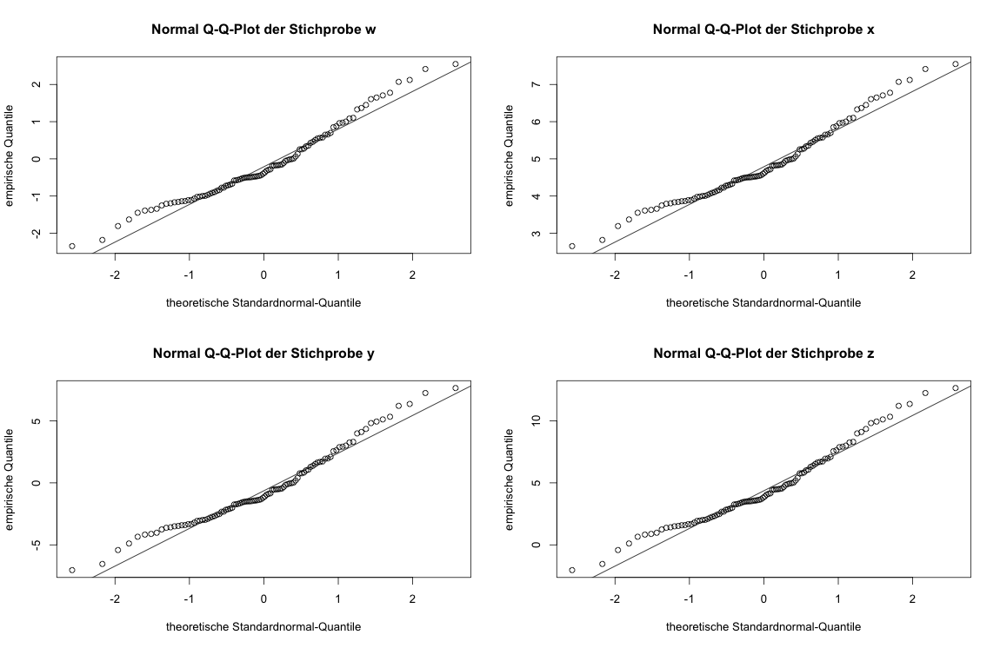

##  **SRM_fig2.14**


```yaml


Name of QuantLet : SRM_fig2.14

Published in : SRM

Description : 'Produces the QQ plots for four simulated samples of 
N(0,1), N(5,1), N(0,9) and N(5,9). QQ-plots compare empirical 
quantiles of a distribution with theoretical quantiles of the standard 
normal distribution.'

Keywords : 'qq-plot, simulation, normal, normal distribution, plot,
graphical representation'

See also : 

Author : Sandor

Submitted :

Datafile : 

Example :
- 'Q-Q-Normal-Plots mit Sollgeraden.'

```



```R
## clear history
rm(list = ls(all = TRUE))
graphics.off()

## Q-Q-Normal-Plots mit Sollgeraden
## Mit festem seed zur Reproduktion
set.seed(1234)
w <- rnorm(100)
set.seed(1234)
x <- rnorm(100, mean = 5)
set.seed(1234)
y <- rnorm(100, sd = 3)
set.seed(1234)
z <- rnorm(100, mean = 5, sd = 3)

par(mfrow = c(2, 2))
qqnorm(w, main = "Normal Q-Q-Plot der Stichprobe w", xlab = "theoretische Standardnormal-Quantile", 
ylab = "empirische Quantile")
qqline(w)

qqnorm(x, main = "Normal Q-Q-Plot der Stichprobe x", xlab = "theoretische Standardnormal-Quantile", 
ylab = "empirische Quantile")
qqline(x)

qqnorm(y, main = "Normal Q-Q-Plot der Stichprobe y", xlab = "theoretische Standardnormal-Quantile", 
ylab = "empirische Quantile")
qqline(y)

qqnorm(z, main = "Normal Q-Q-Plot der Stichprobe z", xlab = "theoretische Standardnormal-Quantile", 
ylab = "empirische Quantile")
qqline(z)
```
