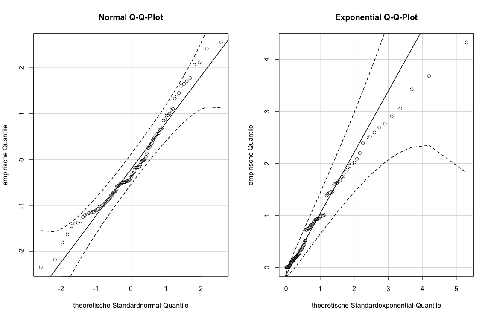

##  **SRM_fig2.16**


```yaml


Name of QuantLet : SRM_fig2.16

Published in : SRM

Description : 'Produces the QQ plots for simulated samples of standard 
normal distribution and exponential distribution with sample size 100. 
QQ-plots compare empirical quantiles of a distribution with theoretical 
quantiles of the standard normal distribution.'

Keywords : 'qq-plot, simulation, normal, normal distribution, plot,
graphical representation, exponential'

See also : 

Author : Wellisch

Submitted :

Datafile : 

Example :
- 'QQ plots for simulated samples of standard normal distribution and 
exponential distribution.'

```



```R
## clear history
rm(list = ls(all = TRUE))
graphics.off()

## install and load packages
libraries = c("car")
lapply(libraries, function(x) if (!(x %in% installed.packages())) {
install.packages(x)
})
lapply(libraries, library, quietly = TRUE, character.only = TRUE)

## Stichproben erzeugen Fuer Reproduktion mit fester seed
set.seed(1234)
x = rnorm(100)
set.seed(1234)
y = rexp(100)

par(mfrow = c(1, 2))

## col.lines=palette()[1] schwarze Sollgerade und KI
qqPlot(x, dist = "norm", envelope = 0.99, col = palette()[1], col.lines = palette()[1], 
main = "Normal Q-Q-Plot", xlab = "theoretische Standardnormal-Quantile", 
ylab = "empirische Quantile")

qqPlot(y, dist = "exp", envelope = 0.99, col = palette()[1], col.lines = palette()[1], 
main = "Exponential Q-Q-Plot", xlab = "theoretische Standardexponential-Quantile", 
ylab = "empirische Quantile")
```
